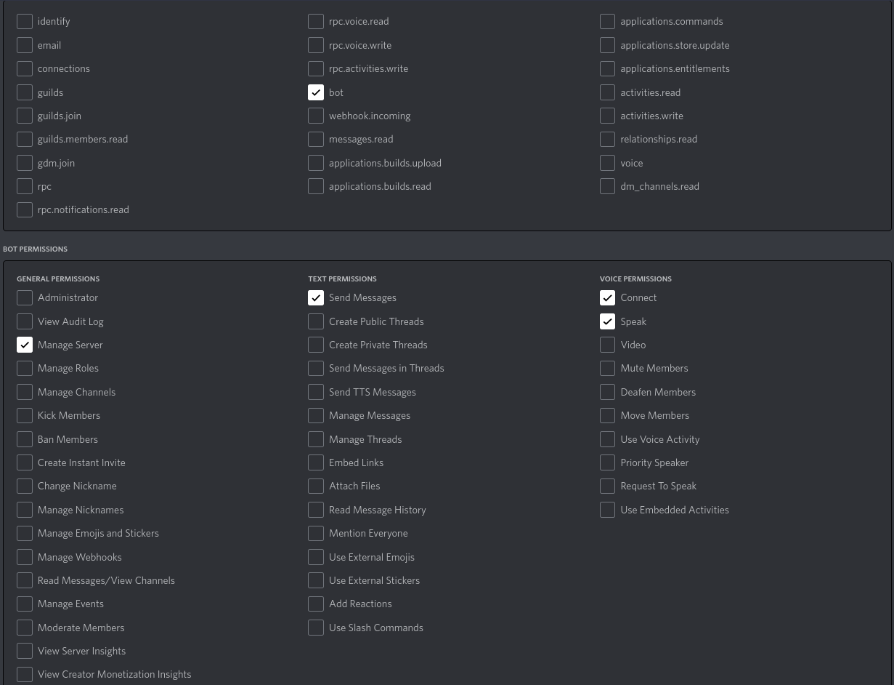

# weatherbot

Discord bot that rolls a weather table once a day.

## Bot permissions
When joining the bot to a server which you have owner or admin rights with, make sure the bot has the following permissions:
  

## Available commands
`/wb_channel set <name>` - Sets the channel to be used to show the current weather  
`/wb_season <season>` - Sets the current season  
`/wb_weather roll` - Rolls a random weather event  
`/wb_weather set <event>` - Sets the current weather event and pauses rolling on the daily timer  
